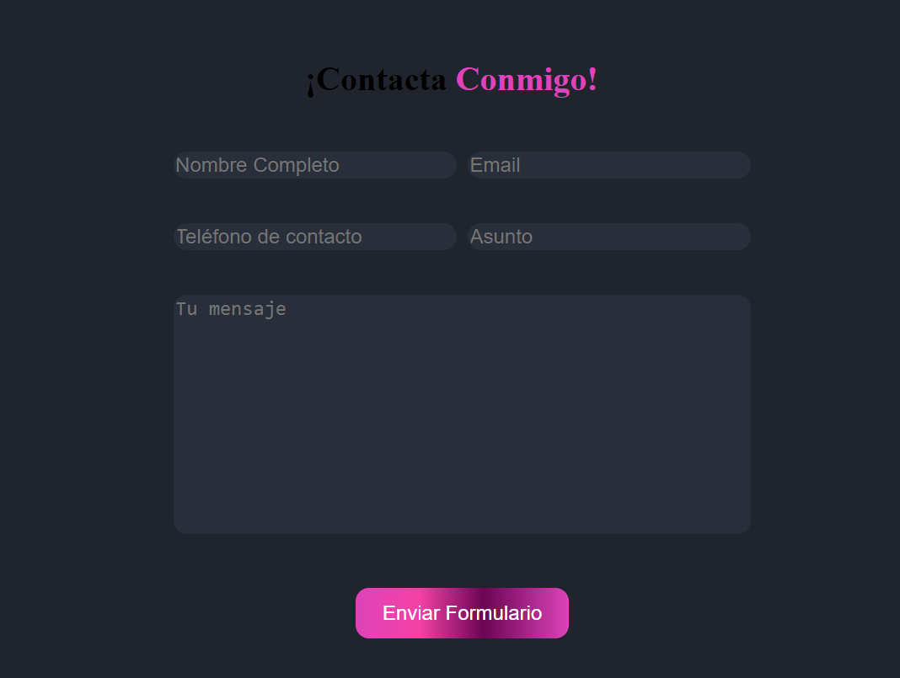

# Simulador de Formulario Real

Este es un proyecto de simulación de formulario web desarrollado con HTML, CSS y JavaScript. El formulario incluye validaciones en tiempo real y mensajes de confirmación.

## Validaciones

### Nombre y Apellido [A-Za-z]

- Acepta cualquier letra mayúscula o minúscula.
- Al menos un carácter debe estar presente.

### Email

- La expresión regular [a-z0-9._%+-]+@[a-z0-9.-]+\.[a-z]{2,}$ se utiliza para validar el campo de correo electrónico.
- Permite letras minúsculas, números y algunos caracteres especiales antes de la @.
- Exige que después de la @ haya letras, números y puntos.
- Requiere un punto y al menos dos letras después del último punto, representando el dominio.

### Teléfono [0-9]{9,}

- Acepta solo caracteres numéricos.
- Exige un mínimo de 9 caracteres numéricos.

### Asunto

- Limita la cantidad de palabras a un máximo de 30.

## Funciones JavaScript

### `validarAsunto()`

Esta función se encarga de validar el campo "Asunto". Verifica que la cantidad de palabras no exceda las 30 y muestra un mensaje de error si es necesario.

### `validarTelefono()`

Esta función valida el campo "Teléfono". Verifica que el número tenga al menos 9 dígitos y muestra un mensaje de error si es necesario.

### `enviarFormulario()`

Esta función se ejecuta al intentar enviar el formulario. Verifica si todos los campos requeridos están completos. Si no lo están, muestra una alerta personalizada. Si todo está completo, muestra un mensaje de confirmación y oculta la alerta personalizada si estaba visible.

### `mostrarAlerta(mensaje)`

Esta función muestra una alerta personalizada con el mensaje proporcionado.

### `cerrarAlerta()`

Cierra la alerta personalizada.

### `cerrarModal()`

Cierra el modal de confirmación y la alerta personalizada si están abiertos.
